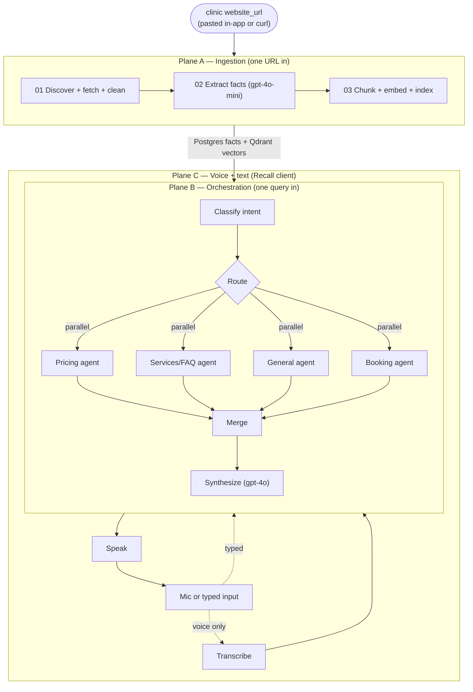

# Dental Clinic RAG Voice Assistant — n8n Agent Orchestration

A voice-enabled, fact-grounded AI receptionist for dental/orthodontic clinics, built as a multi-agent system in **n8n**. Give it a clinic **website URL**; it scrapes the site, extracts structured clinic data, builds a knowledge base, and answers patient questions — by text or by voice — using only what it actually found on that site.

The client, **Recall**, is multi-tenant: add any clinic's URL from the app itself (no curl needed), then talk or type to it. Every `/webhook/*` call requires an API key header — nothing is publicly triggerable.

> Reference clinics: [deroodeortho.com](https://www.deroodeortho.com/) and [ortegaortho.com](https://www.ortegaortho.com/), both ingested with zero clinic-specific code changes. The pipeline is **generic** — point `/webhook/ingest` (or Recall's "Add a clinic" screen) at any clinic's URL and it re-ingests end to end.

## What it actually does (verified, not aspirational)

- **One input, full automation:** `POST /webhook/ingest {website_url}` → crawl → clean → LLM extraction → Postgres facts + Qdrant vectors, ready to answer. No manual data entry, no per-clinic code.
- **Agent orchestration, not a linear chatbot:** an intent classifier fans a query out to the relevant sub-agents **in parallel** (verified: a two-intent question fires both agents simultaneously and merges them into one reply), with a real `collecting → confirming` booking state machine that carries slot info across turns instead of re-asking.
- **Fact-grounded — proven with an eval suite, not just claimed:** `tests/eval/qa.jsonl` runs 14 cases including 5 hallucination probes (off-topic trivia, a fact known to be missing from the KB, a fabricated doctor name, an unstated payment method, a leading fabricated price). **14/14 pass.** See `docs/EVAL_REPORT.md`.
- **Real multi-turn memory:** conversations persist in Postgres; a follow-up like "and who is the doctor that does it" correctly resolves against the prior turn.
- **Voice or text, same pipeline:** speak or type a question, both go through identical grounding, session handling, and error handling — verified locally and through public tunnels simulating a remote user. See `docs/VOICE.md`.
- **Every webhook authenticated:** all 10 workflows require an `X-Webhook-Key` header (n8n `httpHeaderAuth`, including every internal inter-workflow call) — nothing was left publicly callable.

## Architecture



## Stack
- **Orchestration:** n8n — 10 workflows, version-controlled as JSON in `workflows/`, assembled from readable `.js`/`.sql` in `scraping/`, `orchestrator/`, `booking/`, `rag/`, `db/queries/` via `scripts/build_workflows.js`
- **LLM:** OpenAI `gpt-4o-mini` (classify/route/agents) + `gpt-4o` (extraction/synthesis)
- **Embeddings:** local Ollama `nomic-embed-text`
- **Vectors:** Qdrant · **Facts + memory:** Postgres · **Cache:** Redis
- **Voice:** `voice/fallback` — local `faster-whisper` (STT) + Piper (TTS), synchronous, no cloud dependency
- **Client:** `client/` — **Recall**, a multi-tenant browser app: an "Add a clinic" screen (paste a URL, it ingests, shows the real clinic name + extracted counts) and a "Talk" screen (mic or typed text, same pipeline either way)
- **Sharing:** `cloudflared` quick tunnels (`scripts/start_demo.ps1`)

## Repo layout
| Path | Purpose |
|---|---|
| `infra/` | `docker-compose.yml` — n8n, Postgres, Qdrant, Redis, Ollama, voice-fallback |
| `workflows/` | Deployable n8n workflow JSON (generated — see `scripts/build_workflows.js`) |
| `scraping/`, `orchestrator/`, `booking/`, `rag/` | Node source for each workflow's Code nodes |
| `db/` | Schema (`migrations/0001_init.sql`) + parameterized queries (`queries/`) |
| `voice/` | `voice/fallback` (the real, working STT/TTS backend) + n8n voice glue |
| `client/` | **Recall** — multi-tenant browser app (add a clinic, then talk or type to it) |
| `scripts/` | Deploy, bootstrap, health-check, eval, demo-tunnel tooling |
| `tests/eval/` | The eval suite (`qa.jsonl`) and its last run (`results.json`) |
| `docs/` | Architecture, runbook, data model, voice, demo, eval report, ADRs |

## Quickstart
```powershell
cp .env.example .env   # then set OPENAI_API_KEY at minimum
./scripts/bootstrap.ps1
# bootstrap prints your generated N8N_WEBHOOK_API_KEY and ready-to-run curl
# examples with it filled in - every /webhook/* call below needs it as a header:
curl -X POST http://localhost:5679/webhook/ingest -H "Content-Type: application/json" `
  -H "X-Webhook-Key: <value from .env: N8N_WEBHOOK_API_KEY>" `
  -d '{"website_url":"https://www.deroodeortho.com/"}'
curl -X POST http://localhost:5679/webhook/ask -H "Content-Type: application/json" `
  -H "X-Webhook-Key: <value from .env: N8N_WEBHOOK_API_KEY>" `
  -d '{"query":"how much does invisalign cost","website_url":"https://www.deroodeortho.com/"}'
```
Full step-by-step, troubleshooting, and one-time n8n credential setup: **[docs/RUNBOOK.md](docs/RUNBOOK.md)**.

## Try it (voice or text)
```powershell
python -m http.server 8080 --directory client
# open http://localhost:8080?key=<value from .env: N8N_WEBHOOK_API_KEY>
```
No clinic ingested yet? Recall opens straight to "Add a clinic" — paste a URL there instead of curling `/webhook/ingest` by hand. Once a clinic's active, ask it anything by mic or by typing.

To share a live link with a team: **[docs/DEMO.md](docs/DEMO.md)**.

## Documentation
- **[docs/ARCHITECTURE.md](docs/ARCHITECTURE.md)** — how each plane works, why facts+vectors, what's verified
- **[docs/RUNBOOK.md](docs/RUNBOOK.md)** — setup, common operations, troubleshooting table
- **[docs/DATA_MODEL.md](docs/DATA_MODEL.md)** — Postgres schema + Qdrant collection
- **[docs/N8N_CONTROL.md](docs/N8N_CONTROL.md)** — headless n8n deployment + hard-won gotchas
- **[docs/VOICE.md](docs/VOICE.md)** — voice backend details and what was actually tested
- **[docs/DEMO.md](docs/DEMO.md)** — the voice client and live tunnel sharing
- **[docs/EVAL_REPORT.md](docs/EVAL_REPORT.md)** — the 14/14 eval run in detail
- **[docs/adr/](docs/adr/)** — why the key decisions were made this way
- **[PLAN.md](PLAN.md)** — the original 170-step build plan this project was built from

## Known limitations (stated plainly, not hidden)
- `ingestion_runs`/`page_coverage` audit tables exist in the schema but nothing writes to them yet — ingestion itself works and is idempotent, there's just no per-run audit trail.
- STT on domain-specific brand names ("Invisalign") isn't perfect with the current Whisper model — verified acceptable in practice (the orchestrator's classifier tends to understand it anyway) but not guaranteed for every phrasing.
- `voicebox` (the richer voice backend originally named in the brief) never completed building in this environment; `voice/fallback` is the real, working backend. See `docs/adr/0002-voice-fallback-over-voicebox.md`.
- Every webhook now requires the `X-Webhook-Key` header, so a found tunnel URL alone can't trigger scraping or burn OpenAI credits — but the key still travels in a shareable link's query string (`?key=`), so it stops casual/automated abuse, not a determined person actively using that link. Fine for a short team demo, not for a long-lived public deployment.
- Recall's "recent clinics" list is per-browser `localStorage`, not a backend clinic directory — there's no `/webhook/clinics` listing endpoint. On a different device you re-paste the URL, which re-runs the full crawl (60-100s) even though the clinic's already indexed; there's no cheap "look up an existing clinic" path yet, only ingest.
- ~~Genericity not re-verified against a second clinic~~ **Verified**: ingested a second, unrelated real clinic (ortegaortho.com) with zero code changes — both clinics' data confirmed isolated (asking each clinic "who is the orthodontist" correctly returns its own doctor, never the other's). Found and fixed two real gaps in the process: `hours` facts were extracted into Postgres but never indexed for retrieval (see `docs/EVAL_REPORT.md`), and entity dedup only normalized case/whitespace, so punctuation and name-prefix variants ("Dr Holland" / "Dr. William 'Vaughn' Holland") landed as separate duplicate rows instead of one merged doctor — both fixed and re-verified against both clinics.

## License
MIT — see [LICENSE](LICENSE).
